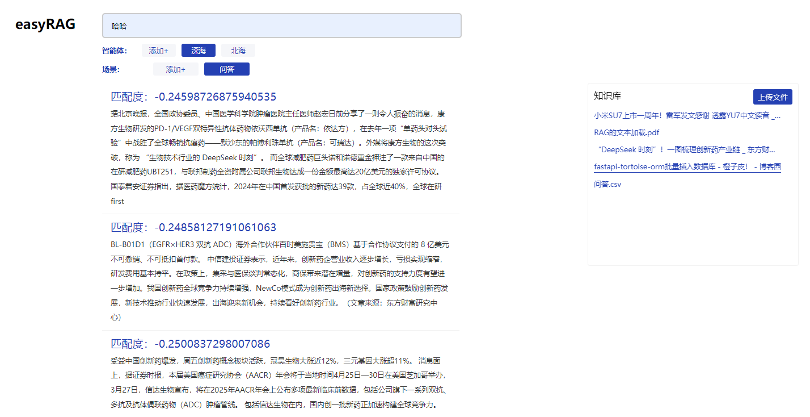

### easyRAG：简单易用的 RAG 管理系统

**easyRAG** 是一个开源的、简单易用的 RAG（Retrieve, Augment, Generate）管理系统，旨在为用户提供高效、便捷的数据管理和检索体验。

#### 开始使用

- **安装数据库**：安装 PostgreSQL数据库，并安装pgvector 插件 [安装教程](./docs/pgvectorInstall.md)
- **修改.env**：修改你的信息数据库信息，并定义模型存放位置。模型一般较大，建议和代码分离存放在公共区域。如果用docker，也建议在宿主机上存放。
- **安装扩展**：  默认安装的torch版本是cpu的，做搜索问题不大，但是要上传大文件还是有点吃力。建议在本地或局域网管理的时候安装cuda版本[安装教程](./docs/torchcuda.md)

```bash
pip install -r requirements.txt
```
- **下载模型**：
```bash
python downloader.py
```
- **运行**：
```bash
python manage.py
```

#### 核心功能

- **多格式文件支持**：支持上传多种常见格式的文件，包括 TXT、PDF 和 CSV，方便用户快速导入数据。
- **网页内容抓取**：能够抓取网页链接中的内容，并将其存储到系统中，进一步丰富数据来源。
- **智能体与场景管理**：允许用户将数据上传到不同的智能体和场景中，满足多样化的业务需求。
- **高效向量检索**：采用 AI 模型（ AI-ModelScope/bge-large-zh-v1.5）将文本编码为向量表示，并利用 PostgreSQL 的 pgvector 插件高效存储和检索向量。
- **灵活的 API 接口**：提供丰富的 API 接口，支持基于指定关键词的高精度匹配查询，以及搜索指定智能体的指定场景。

#### 技术栈

- **FastAPI**：现代、高性能的 Web 开发框架，支持异步操作，提供高性能的 API 服务。
- **Tortoise ORM**：易于使用的异步 ORM 框架，灵感来自 Django，支持多种数据库后端，包括 PostgreSQL。
- **PostgreSQL + pgvector**：强大的开源关系型数据库，结合 pgvector 插件，能够高效存储和检索向量数据。
- **AI 模型**：使用 AI-ModelScope/bge-large-zh-v1.5 模型将文本编码为向量，支持中文文本的高效处理。


